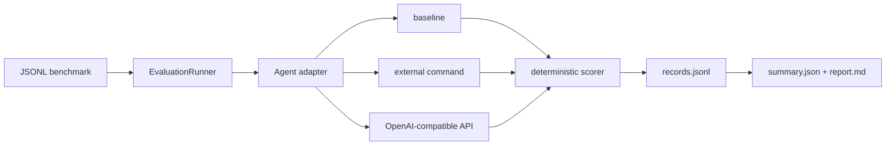

# 架构说明

## 设计原则

- **可比**：任务、scorer 与运行配置独立于 Agent 和模型。
- **可复现**：每次运行生成不可变 manifest、逐样本记录与汇总结果。
- **可审计**：保留工具轨迹、错误、token 与耗时，不只保留最终分数。
- **可扩展**：外部 Agent 用一行 JSON 协议桥接，各框架可以隔离依赖。
- **安全默认**：密钥只从环境变量读取；具有副作用的工具后续必须进入沙箱。

## 当前数据流

## 核心对象

- `Task`：输入、期望结果、scorer、标签和扩展元数据。
- `Agent`：接收 `Task`，返回 `AgentResult` 的最小协议。
- `AgentResult`：最终输出、token/cost、执行轨迹和 Agent 元数据。
- `RunRecord`：一次样本执行的不可变事实记录。
- `EvaluationRunner`：执行重复实验、隔离单样本失败、落盘和汇总。
- `reporting`：读取多个版本化 summary，生成横向比较表。

## 下一步接口

1. 用 task provider 抽象静态 JSONL、Docker 环境和第三方 benchmark。
2. 增加 sandbox provider，默认限制网络、CPU、内存、时间和工作目录。
3. 增加非确定性 judge，但强制记录 judge 模型、prompt、版本及重复评审结果。
4. 增加 experiment matrix：`agent × framework × model × dataset × seed`。
5. 用 DuckDB/Parquet 汇集运行结果，并为演示网页提供只读查询接口。
