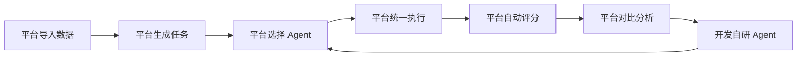
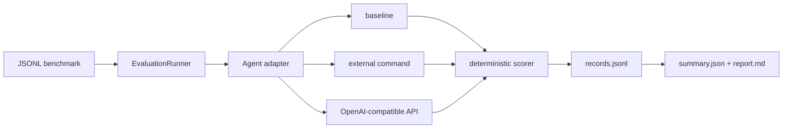

# 架构说明

## 设计原则

- **可比**：任务、scorer 与运行配置独立于 Agent 和模型。
- **可复现**：每次运行生成不可变 manifest、逐样本记录与汇总结果。
- **可审计**：保留工具轨迹、错误、token 与耗时，不只保留最终分数。
- **可扩展**：外部 Agent 用一行 JSON 协议桥接，各框架可以隔离依赖。
- **安全默认**：密钥只从环境变量读取；具有副作用的工具后续必须进入沙箱。

## 产品与架构主线

- 长期建设公平比较不同 Agent、框架和模型的平台，但评测能力最终服务于自研 Agent
  框架的设计、消融和回归验证。
- 第一阶段只要求跑通一个最小闭环：接入 Enginuity Bench，从中定义一个可自动评分的
  文档与工程视觉任务，在相同输入、工具和预算下对比 Claude Code 与 Codex。
- 所有能力由同一个平台维护。平台统一管理任务版本、运行环境、Agent 配置、执行过程、
  日志、评分和对比报告；CLI、网页和后续调度器共享相同的数据模型。

## 第一阶段目标数据流

第一阶段使用 Enginuity Bench 打通这条最小纵向链路，并用 Claude Code 与 Codex 作为
首批对照。闭环稳定后，自研 Agent 作为第三个受测实现接入相同流程。平台通过对比结果
和失败轨迹定位框架改进点，再用相同任务做回归和消融实验。

## 平台核心对象

1. `Dataset`：数据来源、版本、许可、本地缓存和数据切分；首个实例为 Enginuity Bench。
2. `TaskDefinition`：由数据集产生的输入、目标、约束、环境和评分规则。
3. `AgentDefinition`：Claude Code、Codex、自研 Agent，以及各自版本和运行配置。
4. `Experiment`：任务、Agent、模型、参数和重复次数的组合。
5. `Run`：一次真实执行的输入、过程、日志、产物、耗时、成本和错误。
6. `Result`：评分、横向对比、失败归因，以及对自研 Agent 的改进反馈。

这六类对象由平台统一持久化和关联。网页、CLI 和 Runner 都只是同一平台的不同入口或
执行组件，不能各自维护独立状态。

## 当前数据流

当前仓库实现的仍是下列 v0.1 文件型评测内核，尚未连接上述完整平台闭环：

## 当前 v0.1 代码对象

- `Task`：输入、期望结果、scorer、标签和扩展元数据。
- `Agent`：接收 `Task`，返回 `AgentResult` 的最小协议。
- `AgentResult`：最终输出、token/cost、执行轨迹和 Agent 元数据。
- `RunRecord`：一次样本执行的不可变事实记录。
- `EvaluationRunner`：执行重复实验、隔离单样本失败、落盘和汇总。
- `reporting`：读取多个版本化 summary，生成横向比较表。

## 下一步接口

1. 定义平台、CLI 和 Runner 共用的任务与运行配置 schema。
2. 实现 Enginuity Bench 数据接入、任务生成和自动评分。
3. 通过适配器接入 Claude Code 与 Codex，统一记录执行日志、输出、耗时和可获得的用量。
4. 将 Web 控制台连接 Runner，并展示真实运行状态和对比报告。
5. 闭环稳定后再扩展 experiment matrix、沙箱、结果仓库和第三方 benchmark。
