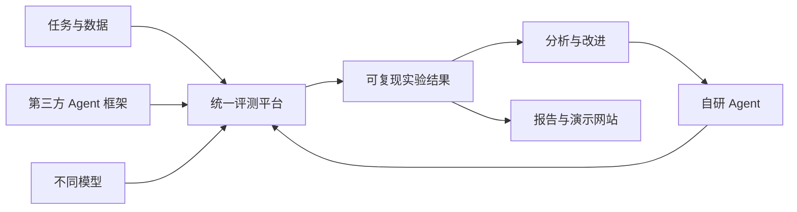

# xAgent 产品与实施规划

## 1. 项目定位

xAgent 是一个面向真实任务的 Agent 实验室。它不把目标限定为某个模型排行榜，
而是建立一套可复现、可解释的实验方法，用来：

1. 比较不同 Agent 框架在相同或不同模型下的实际任务表现；
2. 找到 Agent 失败的原因，并用实验结果指导自研 Agent；
3. 沉淀任务、数据、运行轨迹、分析报告和演示产品。

当前优先级是“先造可靠的尺子，再扩充题目和 Agent”。

## 1.1 模型与算力策略

- 只关注同一时期能力最强的一组前沿模型，不以覆盖大量中小模型为目标；
- 默认通过官方或兼容 API 调用模型，并在实验中固定完整模型 ID、版本和推理参数；
- GPU 不是 xAgent 的基础设施依赖，Linux 服务器主要承担 Docker、KVM、任务环境和并发调度；
- 不把本地模型部署、CUDA/NVIDIA 驱动维护或 GPU 性能优化纳入近期主线；
- 只有在研究开源模型、数据隐私或离线部署时，才把 GPU 作为独立专项启用；
- 框架控制变量实验优先固定同一个前沿模型，再比较 Agent scaffold 的差异。

## 2. 评测对象与控制变量

一次 Agent 运行的结果由五类变量共同决定：

```text
任务 × Agent 框架 × Agent 实现 × 模型 × 工具/环境
```

每个实验至少采用以下一种模式，并在报告中明确标注：

### 2.1 控制变量模式

固定任务、模型、工具、prompt、预算和重试策略，只替换 Agent 框架或某个 Agent
机制。用于回答“框架或机制本身是否产生收益”。

### 2.2 最佳实践模式

允许每个框架使用自己的推荐 prompt、状态管理、工具封装和恢复机制。用于回答
“实际采用该框架时，开箱即用的整体表现如何”。

两个模式不能混在同一排行榜中。否则默认 prompt、重试或上下文裁剪的差异会被误认为
模型或框架能力差异。

## 3. 评价指标

任务成功率或程序化任务得分是主指标，其他指标作为约束和诊断信息：

- 任务完成率、分项得分；
- 端到端耗时、模型耗时、工具耗时；
- input/output token、费用；
- 工具调用次数、无效调用、参数错误和执行错误；
- 循环、超时、提前终止、上下文溢出；
- 错误恢复次数和恢复成功率；
- 多次重复运行的方差与置信区间；
- 人工介入、审批和越权尝试；
- 完整但脱敏的执行轨迹。

暂不将这些指标合并成一个不透明的总分。对外展示优先使用成功率、费用、延迟组成的
Pareto 前沿，并提供逐任务下钻。

## 4. 系统边界



项目继续采用单仓库，逐步形成六个逻辑模块：

```text
xAgent
├── eval-core       # 协议、运行器、指标、结果与报告
├── adapters        # Agents SDK、LangGraph、第三方及自研 Agent 适配
├── benchmarks      # 本地任务、上游 benchmark 兼容层
├── agents          # 自研 Agent 与机制消融版本
├── experiments     # 版本化实验矩阵和可复现配置
├── dashboard       # 结果分析、轨迹查看和公开演示
└── docs            # 方法论、调研、数据卡和分析报告
```

不同 Agent 框架优先通过独立进程协议接入，避免依赖冲突，也避免第三方框架侵入评测
核心。上游 benchmark 优先调用或转换，不复制维护其环境和数据。

## 5. 实施阶段

### Phase 0：可运行骨架（已完成）

- Task、Agent、Result 最小协议；
- JSONL 数据集和确定性 scorer；
- 内置、外部命令和 OpenAI-compatible 三类适配；
- manifest、逐样本记录、汇总和比较报告；
- 单元测试、静态检查和 CI。

### Phase 1：可信评测闭环

目标：一条命令运行 `任务集 × Agent × 模型 × 重复次数` 实验矩阵。

交付项：

- 版本化实验配置；
- 并发、超时、有限重试、随机种子和预算；
- 数据、代码、环境、模型参数和工具 schema 指纹；
- DuckDB/Parquet 结果仓库；
- 置信区间、成对比较、按标签统计；
- 模型错误、Agent 错误、工具错误和评测器错误分离；
- 结果及轨迹脱敏。

验收门槛：

- 同一实验能在另一台机器复现；
- 单样本失败不会中断整批实验；
- 能解释两个 Agent 的差距集中在哪些任务和失败类型；
- 评测器自身故障不会被错误地记为 Agent 得 0 分。

### Phase 2：小而真实的本地任务集

目标：形成 30–50 个可快速执行、可重置、可程序化验证的任务。

首批领域：

- 文件读取、检索与修改；
- Shell 和代码执行；
- 结构化数据分析；
- HTTP/API 和多工具调用；
- 错误恢复与幂等重试；
- 权限边界和 prompt injection；
- 长步骤任务中的循环、停机和预算控制。

任务按 L1 单工具、L2 多工具、L3 规划/验证/恢复分级。每个任务提供数据卡，说明
来源、验证器、资源限制、网络策略、许可证、污染风险和危险操作。

验收门槛：任务集有区分度，不出现所有 Agent 全对或全错；任务重跑不会受上一轮状态
污染；主要得分由程序化验证产生。

### Phase 3：首轮框架比较

首批比较对象：

1. 无框架的原生 ReAct 基线；
2. OpenAI Agents SDK；
3. LangGraph；
4. 一个代码行动范式基线，候选为 smolagents CodeAgent。

每轮同时运行控制变量模式与最佳实践模式，每个组合至少重复 3–5 次。首份报告回答：

- 框架是否提高成功率；
- 收益是否值得额外 token、费用和延迟；
- 哪些失败来自模型，哪些来自 Agent scaffold；
- 哪种方案更容易恢复错误；
- 结论是否跨重复运行稳定。

验收门槛：产出包含完整配置、任务版本、原始记录、置信区间和失败案例的内部报告，
而不只是排行榜。

### Phase 4：标准 benchmark 兼容

接入顺序：

1. Harbor/Terminal-Bench 兼容或结果导入；
2. BFCL 和 τ³-bench 文本 `base` 子集等工具交互任务；
3. WebArena-Verified Hard 等可验证浏览器任务；
4. SWE-bench 的小型、较新且可稳定构建的子集；
5. OSWorld、WorkArena、AndroidWorld 等重型 GUI 环境。

验收门槛：不修改上游语义即可运行或导入结果；记录上游版本、镜像 digest、许可证和
本地转换；与上游 harness 做小样本结果一致性检查。

### Phase 5：自研 Agent

按以下顺序增加能力：

1. ReAct；
2. 计划—执行；
3. 执行结果验证；
4. 失败反思和有限重试；
5. 检查点与恢复；
6. 上下文压缩和记忆；
7. 子任务委派和多 Agent。

每个机制必须做消融实验。首个产品目标是：在相同模型、工具和预算下，本地 L1/L2
任务成功率稳定超过原生 ReAct，且成本增幅不超过 30%。

### Phase 6：数据与演示产品

当已有可靠实验数据后，再实现：

- 实验、Agent、模型和任务筛选；
- 成功率、费用、延迟及置信区间；
- 成本—质量 Pareto 图；
- 单任务轨迹和失败类型查看；
- 数据卡、实验配置和可复现实验包下载；
- 经人工审核的公开报告或 leaderboard。

## 6. 近期两周执行清单

1. 定义 experiment matrix 配置和 schema；
2. 实现并发、超时、重试、预算和随机种子；
3. 接入 DuckDB/Parquet；
4. 建立首批 20 个本地工具任务；
5. 实现无框架 ReAct 基线；
6. 接入 OpenAI Agents SDK 和 LangGraph；
7. 每个组合重复运行至少三次；
8. 输出第一份内部对比报告。

迭代结束时必须能回答：

> 在同一个模型、同一套工具和同一批任务下，原生 ReAct、OpenAI Agents SDK 和
> LangGraph 的成功率、稳定性、速度与成本分别如何？

## 7. 暂不投入的事项

- 在没有真实实验数据前建设大型展示网站；
- 一开始运行完整 SWE-bench 或 GUI benchmark；
- 在单 Agent 基线未稳定前构建复杂多 Agent 系统；
- 将第三方框架直接耦合进 `eval-core`；
- 只依赖 LLM judge 的开放式评分；
- 没有消融实验支撑的 planner、memory、reflection 功能堆叠。

## 8. 核心原则

- 评测核心独立于 Agent 框架和模型供应商；
- 先保证有效性、可复现性和可审计性，再扩大任务数量；
- 优先验证真实任务结果，不用表面文本作为完成代理；
- 分开衡量模型能力、框架能力和自研机制能力；
- 轨迹用于解释原因，分数用于衡量结果；
- 上游数据和环境优先复用，避免形成不可维护的私有标准；
- 自研 Agent 的每项复杂机制都必须通过消融实验证明价值。
