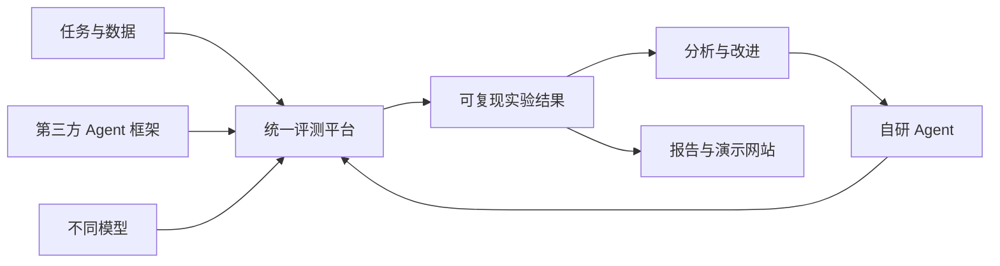

# xAgent 产品与实施规划

## 1. 项目定位

xAgent 是一个面向真实任务的 Agent 实验室。长期目标是建立公平比较不同 Agent、框架
和模型的平台，但评测是手段，不是最终产品目标。平台应通过真实对比和失败分析，持续
指导自研 Agent 框架的开发。具体用来：

1. 比较不同 Agent 框架在相同或不同模型下的实际任务表现；
2. 找到 Agent 失败的原因，并把实验结果转化为自研 Agent 框架的需求和回归用例；
3. 由统一平台沉淀任务、环境、配置、运行轨迹、评分、分析报告和演示产品。

当前优先级是先跑通一个由平台管理的最小闭环：接入 Enginuity Bench，从中定义一个
可自动评分的文档与工程视觉任务，在一致条件下对比 Claude Code 与 Codex 的实际效果。
闭环稳定后，再接入自研 Agent，扩大任务和评测能力。

## 1.1 第一阶段最小闭环

第一阶段只回答一个具体问题：

> 在相同 Enginuity Bench 数据、任务说明、工具和资源约束下，Claude Code 与 Codex
> 完成同一个文档与工程视觉任务的正确率、耗时、成本和执行过程有什么差异？

最小闭环由同一个平台维护：

1. 版本化保存数据切片、任务说明、标准答案和评分规则；
2. 准备相同输入和隔离运行目录，分别调用 Claude Code 和 Codex；
3. 保存命令、日志、轨迹、输出产物、耗时和可获得的 token/费用信息；
4. 使用数据集标准答案和任务规则进行自动评分；
5. 在平台中展示逐次运行与横向对比报告；
6. 至少重复运行三次，避免把单次偶然结果当作结论。

验收标准是：用户能够从平台创建运行，并在平台内看到两个 Agent 的真实执行状态、
原始证据和可复核的比较结果，不需要手工拼接多套工具。

## 1.2 统一平台闭环

产品不是一组分散的评测脚本，而是围绕一条固定闭环运行：

> 平台导入数据 → 平台生成任务 → 平台选择 Agent → 平台统一执行 → 平台自动评分 →
> 平台对比分析 → 根据结果开发自研 Agent → 新版本回到平台继续测试。

平台维护六类核心对象：

1. **数据集**：首个数据集为 Enginuity Bench，记录来源、版本、许可和切分。
2. **任务**：从数据集中定义具体输入、目标、约束、环境和评分方式。
3. **Agent**：Claude Code、Codex、自研 Agent 及其版本和配置。
4. **实验**：选择任务、Agent、模型、运行参数和重复次数。
5. **运行记录**：保存输入、过程、日志、产物、耗时、成本和错误。
6. **结果**：保存评分、对比和失败原因，并形成自研 Agent 的改进依据。

数据、任务、执行和结果都必须进入这套平台对象，不允许用临时脚本形成另一套无法追踪
的实验流程。

## 1.3 模型与算力策略

- 只关注同一时期能力最强的一组前沿模型，不以覆盖大量中小模型为目标；
- 默认通过官方或兼容 API 调用模型，并在实验中固定完整模型 ID、版本和推理参数；
- GPU 不是 xAgent 的基础设施依赖，Linux 服务器主要承担 Docker、KVM、任务环境和并发调度；
- 不把本地模型部署、CUDA/NVIDIA 驱动维护或 GPU 性能优化纳入近期主线；
- 只有在研究开源模型、数据隐私或离线部署时，才把 GPU 作为独立专项启用；
- 框架控制变量实验优先固定同一个前沿模型，再比较 Agent scaffold 的差异。

## 2. 评测对象与控制变量

一次 Agent 运行的结果由五类变量共同决定：

```text
任务 × Agent 框架 × Agent 实现 × 模型 × 工具/环境
```

每个实验至少采用以下一种模式，并在报告中明确标注：

### 2.1 控制变量模式

固定任务、模型、工具、prompt、预算和重试策略，只替换 Agent 框架或某个 Agent
机制。用于回答“框架或机制本身是否产生收益”。

### 2.2 最佳实践模式

允许每个框架使用自己的推荐 prompt、状态管理、工具封装和恢复机制。用于回答
“实际采用该框架时，开箱即用的整体表现如何”。

两个模式不能混在同一排行榜中。否则默认 prompt、重试或上下文裁剪的差异会被误认为
模型或框架能力差异。

## 3. 评价指标

任务成功率或程序化任务得分是主指标，其他指标作为约束和诊断信息：

- 任务完成率、分项得分；
- 端到端耗时、模型耗时、工具耗时；
- input/output token、费用；
- 工具调用次数、无效调用、参数错误和执行错误；
- 循环、超时、提前终止、上下文溢出；
- 错误恢复次数和恢复成功率；
- 多次重复运行的方差与置信区间；
- 人工介入、审批和越权尝试；
- 完整但脱敏的执行轨迹。

暂不将这些指标合并成一个不透明的总分。对外展示优先使用成功率、费用、延迟组成的
Pareto 前沿，并提供逐任务下钻。

## 4. 系统边界



项目继续采用单仓库，并以统一平台作为控制面，逐步形成六个逻辑模块：

```text
xAgent
├── eval-core       # 协议、运行器、指标、结果与报告
├── adapters        # Agents SDK、LangGraph、第三方及自研 Agent 适配
├── benchmarks      # 本地任务、上游 benchmark 兼容层
├── agents          # 自研 Agent 与机制消融版本
├── experiments     # 版本化实验矩阵和可复现配置
├── dashboard       # 结果分析、轨迹查看和公开演示
└── docs            # 方法论、调研、数据卡和分析报告
```

不同 Agent 框架优先通过独立进程协议接入，避免依赖冲突，也避免第三方框架侵入评测
核心。上游 benchmark 优先调用或转换，不复制维护其环境和数据。

## 5. 实施阶段

### Phase 0：可运行骨架（已完成）

- Task、Agent、Result 最小协议；
- JSONL 数据集和确定性 scorer；
- 内置、外部命令和 OpenAI-compatible 三类适配；
- manifest、逐样本记录、汇总和比较报告；
- 单元测试、静态检查和 CI。

### Phase 1：Claude Code 与 Codex 最小闭环

目标：使用 Enginuity Bench 的一个小型任务，由平台完整运行并公平对比 Claude Code
与 Codex，验证六类核心对象和整条平台闭环。

交付项：

- Enginuity Bench 数据集的版本化接入和一个可自动评分的最小任务；
- Claude Code 与 Codex 两个执行适配器；
- 平台、CLI 和 Runner 共用的运行配置；
- 相同任务快照、环境、权限、超时和预算约束；
- 日志、轨迹、输出产物、评分明细、耗时和用量记录；
- 平台中的运行状态、逐次结果和对比报告；
- 每个 Agent 至少三次重复运行。

验收门槛：

- 能从平台发起、跟踪并查看完整实验，不依赖人工拼接结果；
- 两个 Agent 从相同初始状态开始，评分依据可复核；
- 单次失败不会破坏下一次运行；
- 报告能够说明成功与否，并保留解释差异所需的原始证据。

### Phase 2：自研 Agent 基线

目标：把自研 Agent 作为第三个实现接入已经跑通的平台闭环，直接使用 Claude Code 与
Codex 的结果和失败轨迹指导第一版框架设计。

按以下顺序增加能力：

1. 最小 ReAct 循环；
2. 计划—执行；
3. 执行结果验证；
4. 失败反思和有限重试；
5. 检查点与恢复；
6. 上下文压缩和记忆；
7. 子任务委派和多 Agent。

每个机制必须在同一平台中做消融实验。首个产品目标是：在相同模型、工具和预算下，
自研 Agent 在已纳入平台的任务上稳定超过简单 ReAct 基线，并能从与 Claude Code、
Codex 的差距中明确下一项框架改进。

### Phase 3：公平评测基础设施与本地任务集

目标：在最小闭环之上形成可扩展的实验能力，并逐步建立 30–50 个可快速执行、可重置、
可程序化验证的本地任务。

基础设施包括：

- experiment matrix、并发、有限重试、超时、随机种子和预算；
- 成本表与统一 token/cost 统计；
- 置信区间、成对比较、按标签统计和失败聚类；
- 模型错误、Agent 错误、工具错误和评测器错误分离；
- 基于 DuckDB/Parquet 的结果仓库；
- 结果、轨迹和敏感信息脱敏。

任务逐步覆盖文件与代码、结构化数据、HTTP/API、多工具调用、异常恢复、安全边界和
长步骤预算控制，并按 L1 单工具、L2 多工具、L3 规划/验证/恢复分级。

验收门槛：任务集有区分度，任务重跑不受上一轮状态污染；同一实验可在另一台机器
复现；平台能够解释不同 Agent 的差距集中在哪些任务和失败类型。

### Phase 4：标准 benchmark 兼容

接入顺序：

1. Harbor/Terminal-Bench 兼容或结果导入；
2. BFCL 和 τ³-bench 文本 `base` 子集等工具交互任务；
3. WebArena-Verified Hard 等可验证浏览器任务；
4. SWE-bench 的小型、较新且可稳定构建的子集；
5. OSWorld、WorkArena、AndroidWorld 等重型 GUI 环境。

验收门槛：不修改上游语义即可运行或导入结果；记录上游版本、镜像 digest、许可证和
本地转换；与上游 harness 做小样本结果一致性检查。

### Phase 5：扩展 Agent、框架与模型比较

首批扩展对象：

1. 无框架的原生 ReAct 基线；
2. OpenAI Agents SDK；
3. LangGraph；
4. 一个代码行动范式基线，候选为 smolagents CodeAgent。

每轮同时运行控制变量模式与最佳实践模式，每个组合至少重复 3–5 次。报告框架是否
提高成功率、收益是否值得额外成本与延迟、失败来源及恢复能力，并继续把结论用于自研
Agent 框架的机制选择。

验收门槛：产出包含完整配置、任务版本、原始记录、置信区间和失败案例的内部报告，
而不只是排行榜。

### Phase 6：数据与演示产品

当已有可靠实验数据后，再实现：

- 实验、Agent、模型和任务筛选；
- 成功率、费用、延迟及置信区间；
- 成本—质量 Pareto 图；
- 单任务轨迹和失败类型查看；
- 数据卡、实验配置和可复现实验包下载；
- 经人工审核的公开报告或 leaderboard。

## 6. 近期两周执行清单

1. 接入并冻结 Enginuity Bench 的首个小型数据切片；
2. 定义数据集、任务、Agent、实验、运行记录和结果六类平台对象；
3. 实现数据准备、统一执行和自动评分；
4. 接入 Claude Code 和 Codex 执行适配器；
5. 统一记录日志、轨迹、输出产物、评分明细、耗时和可获得的用量；
6. 将 Web 控制台接入真实 Runner；
7. 每个 Agent 重复运行至少三次；
8. 在平台输出第一份可复核的对比报告。

迭代结束时必须能回答：

> 在同一个 Enginuity Bench 任务和一致资源约束下，Claude Code 与 Codex 的正确率、
> 稳定性、速度、成本和失败过程分别如何？

## 7. 暂不投入的事项

- 在没有真实实验数据前建设大型展示网站；
- 一开始运行完整 SWE-bench 或 GUI benchmark；
- 在单 Agent 基线未稳定前构建复杂多 Agent 系统；
- 将第三方框架直接耦合进 `eval-core`；
- 只依赖 LLM judge 的开放式评分；
- 没有消融实验支撑的 planner、memory、reflection 功能堆叠。

## 8. 核心原则

- 评测核心独立于 Agent 框架和模型供应商；
- 先保证有效性、可复现性和可审计性，再扩大任务数量；
- 优先验证真实任务结果，不用表面文本作为完成代理；
- 分开衡量模型能力、框架能力和自研机制能力；
- 轨迹用于解释原因，分数用于衡量结果；
- 上游数据和环境优先复用，避免形成不可维护的私有标准；
- 自研 Agent 的每项复杂机制都必须通过消融实验证明价值。
